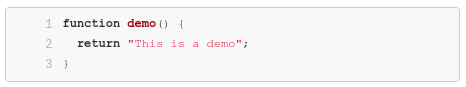

# Code highlighting for Enonic XPs HTML Editor

[  ](https://bintray.com/itemconsulting/public/no.item.xp.lib-xp-highlight/1.0.0/link)

## Usage

### Add dependency

To use the library add the following to you `gradle.build` file:

```groovy
dependencies {
    include "no.item.xp:lib-xp-highlight:1.0.0"
}
```

### Usage in **Content Studio**:

 1. Enter an HTML-editor in Content Studio
 2. Select **Insert Macro** on the toolbar
 3. Select **Code Highlighting**, and pick a *language*.
 4. Your code will now contain the following macro: `[highlight language="javascript"/]`
 5. Code now can be written between `[highlight]` and `[/highlight]`:
     ```html
    [highlight language="javascript"]
    <pre>
    function demo() {
      return "This is a demo";
    }
    </pre>
    [/highlight]
    ```
 6. The markup rendered on the page will now contain code highlighting
    

## Deploying

### Building

To build he project run the following code

```bash
./gradlew build
```

### Deploy locally

Deploy locally for testing purposes:

```bash
./gradlew publishToMavenLocal
```

### Deploy to Bintray

Since we should not check secrets into git, first you need to add some parameters to `~/.gradle/gradle.properties` to be
able to publish:

```properties
bintrayUser=myUser
bintrayApiKey=mySecretApiKey
```

Run the following code to deploy a new version of the library to [Bintray](https://bintray.com/itemconsulting).

```bash
./gradlew bintrayPublish
```
